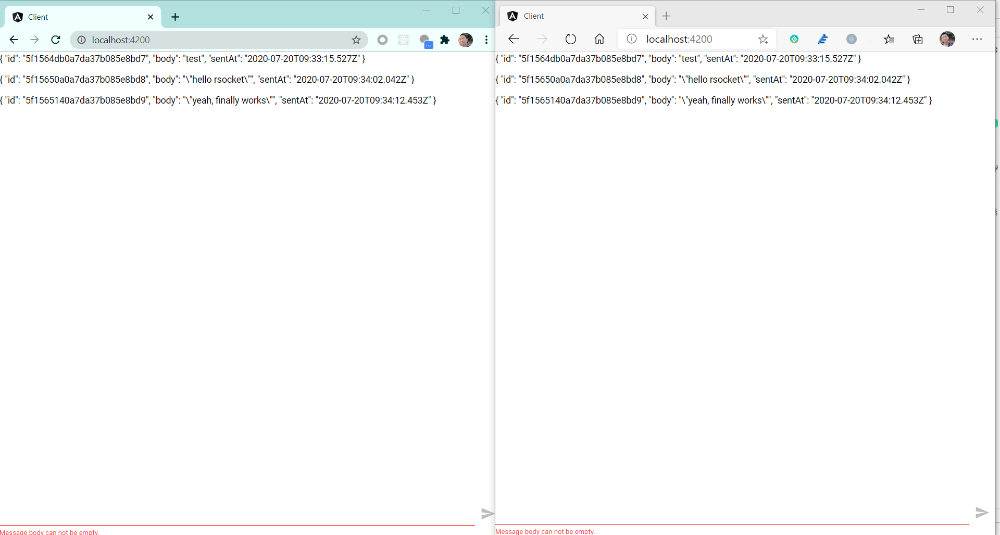

# Building a Chat application with Angular and Spring RSocket


In this post, we will use RSocket protocol to reimplement the chat application.

If you have missed the former posts about implementing the chat application, there is a checklist.

* [Building a chat app with Angular and Spring reactive WebSocket](https://medium.com/@hantsy/building-a-chat-application-with-angular-and-spring-reactive-websocket-400e0769f4ec)  and [part 2](https://medium.com/@hantsy/building-a-chat-application-with-angular-and-spring-reactive-websocket-part-2-ad140125cbd2)
* [Building a chat app with Angular and Spring reactive Server Sent Events](https://medium.com/@hantsy/building-a-chat-application-with-angular-and-spring-reactive-sse-c0fdddcd7d70)

[RSocket](https://www.rsocket.io) is a binary protocol for use on byte stream transports, such as TCP, WebSocket, RCP etc.

RSocket embraces ReactiveStreams semantics, and Spring provides excellent RSocket support  through the existing  messaging infrastructure. I have introduced RSocket in my former posts, check here.

* [Using RSocket with Spring](https://medium.com/@hantsy/using-rsocket-with-spring-boot-cfc67924d06a)
* [Building a CRUD application with RSocket and Spring](https://medium.com/@hantsy/building-a-crud-application-with-rsocket-and-spring-936570c72467)

In this post, we will use WebSocket as transport protocol which is good for web application.  RSocket defines 4 interaction modes, we will use *fire-and-forget* to send a message to the server side, and  *request/streams* to retrieve messages as an infinite stream from the server.

Firstly let's create the server application. Generate a project skeleton using [Spring Initializr](https://start.spring.io).

* Project type: Gradle
* Language: Kotlin
* Spring Boot version :2.4.0M1
* Project Metadata/Java: 14
* Dependencies: Reactive Web, RSocket

Hit the **Generate** button to download the generated archive,  and extract it into your local disk.

Make sure you have installed the latest JDK 14  ([AdoptOpenJDK]( https://adoptopenjdk.net/) is highly recommended),  then import the source codes in your IDEs. eg. Intellij IDEA, and start to implement the server side.

> We also skip the discussion of  Reactor's Sink implementation here.

Create  a `Message`  document definition and a `Repository` for it.

```kotlin
interface MessageRepository : ReactiveMongoRepository<Message, String> {
    @Tailable
    fun getMessagesBy(): Flux<Message>
}

@Document(collection = "messages")
data class Message(@Id var id: String? = null, var body: String, var sentAt: Instant = Instant.now())
```

Create a `@Controller`  to handle messages.

```kotlin
@Controller
class MessageController(private val messages: MessageRepository) {
    @MessageMapping("send")
    fun hello(p: String) = this.messages.save(Message(body = p, sentAt = Instant.now())).log().then()

    @MessageMapping("messages")
    fun messageStream(): Flux<Message> = this.messages.getMessagesBy().log()
}
```

The **send** route accepts a String based message payload and  return a `Mono<Void>`, which will handle messages of the *fire-and-forget* mode from clients. The **messages** route accepts a null payload and return a `Flux<Message>`, which will act as the handler of *request-stream* mode.

> If you are new to the Spring RSocket , you may be confused how `@Controller` and `MessageMapping`  are mapped to the interaction modes which the original RSocket message handler used. Spring hides the complexity of the RSocket protocol itself , and reuse the existing messaging infrastructure to handle RSocket messages.  Remember, compare the incoming payload and outgoing message type with 4 interaction mode definitions in the official [RSocket](rsocket.io) website, you can determine which interaction mode it is mapped to.

Configure RSocket to use websocket transport in the *application.properties* file.

```properties
# a mapping path is defined
spring.rsocket.server.mapping-path=/rsocket
# websocket is chosen as a transport
spring.rsocket.server.transport=websocket
```

Start a MongoDB service as follows.

```bash
docker-compose up mongodb
```

> As  described in the former posts, you have to prepare a **capped** messages collection, check [this post ](https://medium.com/@hantsy/building-a-chat-application-with-angular-and-spring-reactive-websocket-part-2-ad140125cbd2) for more details.

Run the following command to start the server side application.

```bash
./gradlew bootRun
```

I have written a small integration test to verify if it works.

```kotlin
@SpringBootTest
class RSocketServerApplicationTests {

    @Autowired
    lateinit var rSocketRequester: RSocketRequester;

    @Test
    fun contextLoads() {

        val verifier= rSocketRequester.route("messages")
                .retrieveFlux(Message::class.java)
                .log()
                .`as` { StepVerifier.create(it) }
                .consumeNextWith { it -> assertThat(it.body).isEqualTo("test message") }
                .consumeNextWith { it -> assertThat(it.body).isEqualTo("test message2") }
                .thenCancel()
                .verifyLater()
        rSocketRequester.route("send").data("test message").send().then().block()
        rSocketRequester.route("send").data("test message2").send().then().block()

        verifier.verify(Duration.ofSeconds(5))
    }

    @TestConfiguration
    class TestConfig {

        @Bean
        fun rSocketRequester(builder: RSocketRequester.Builder) = builder.dataMimeType(MimeTypeUtils.APPLICATION_JSON)
                .connectWebSocket(URI.create("ws://localhost:8080/rsocket")).block()
    }

}
```

In the above codes, use a test specific `@TestConfiguration` to define a `RSocketRequester` bean, which is a helper to communicate with the server side.

Let's move to the frontend application.

Create a new Angular project, and add two dependencies: `roscket-core`, `rsocket-websocket-client`.

```bash
npm install roscket-core rsocket-websocket-client
```
Fill the following codes in the `app.component.ts` file. I've spent some time on making this work with my backend,  the article [ RSocket With Spring Boot + JS: Zero to Hero](https://dzone.com/articles/rsocket-with-spring-boot-amp-js-zero-to-hero) from  [Domenico Sibilio ](https://dzone.com/users/3880926/domenicosibilio.html)  is very helpful. The [rsocket-js ](https://github.com/rsocket/rsocket-js) project also includes excellent examples.

```typescript
export class AppComponent implements OnInit, OnDestroy {

  title = 'client';
  message = '';
  messages: any[];
  client: RSocketClient;
  sub = new Subject();

  ngOnInit(): void {
    this.messages = [];

    // Create an instance of a client
    this.client = new RSocketClient({
      serializers: {
        data: JsonSerializer,
        metadata: IdentitySerializer
      },
      setup: {
        // ms btw sending keepalive to server
        keepAlive: 60000,
        // ms timeout if no keepalive response
        lifetime: 180000,
        // format of `data`
        dataMimeType: 'application/json',
        // format of `metadata`
        metadataMimeType: 'message/x.rsocket.routing.v0',
      },
      transport: new RSocketWebSocketClient({
        url: 'ws://localhost:8080/rsocket'
      }),
    });

    // Open the connection
    this.client.connect().subscribe({
      onComplete: (socket: RSocket) => {

        // socket provides the rsocket interactions fire/forget, request/response,
        // request/stream, etc as well as methods to close the socket.
        socket
          .requestStream({
            data: null, // null is a must if it does not include a message payload, else the Spring server side will not be matched.
            metadata: String.fromCharCode('messages'.length) + 'messages'
          })
          .subscribe({
            onComplete: () => console.log('complete'),
            onError: error => {
              console.log("Connection has been closed due to:: " + error);
            },
            onNext: payload => {
              console.log(payload);
              this.addMessage(payload.data);
            },
            onSubscribe: subscription => {
              subscription.request(1000000);
            },
          });

        this.sub.subscribe({
          next: (data) => {
            socket.fireAndForget({
              data: data,
              metadata: String.fromCharCode('send'.length) + 'send',
            });
          }
        })
      },
      onError: error => {
        console.log("Connection has been refused due to:: " + error);
      },
      onSubscribe: cancel => {
        /* call cancel() to abort */
      }
    });
  }

  addMessage(newMessage: any) {
    console.log("add message:" + JSON.stringify(newMessage))
    this.messages = [...this.messages, newMessage];
  }

  ngOnDestroy(): void {
    this.sub.unsubscribe();
    if (this.client) {
      this.client.close();
    }
  }

  sendMessage() {
    console.log("sending message:" + this.message);
    this.sub.next(this.message);
    this.message = '';
  }
}

```

Reuse the template file we've used in the former posts.

```html
<div fxFlex>
    <p *ngFor="let m of messages">
        {{m|json}}
    </p>
</div>
<div>
    <form fxLayout="row baseline" #messageForm="ngForm" (ngSubmit)="sendMessage()">
        <mat-form-field fxFlex>
            <input name="message" fxFill matInput #messageCtrl="ngModel" [(ngModel)]="message" required />
            <mat-error fxLayoutAlign="start" *ngIf="messageCtrl.hasError('required')">
                Message body can not be empty.
            </mat-error>
        </mat-form-field>
        <div>
            <button mat-button mat-icon-button type="submit" [disabled]="messageForm.invalid || messageForm.pending">
                <mat-icon>send</mat-icon>
            </button>
        </div>
    </form>
</div>
```

Next run the client application.

```bash
npm run start
```

Open two browser windows(or two different browsers), type some messages in each window and experience it.



> I found a weird issue may be caused by the JSON Serializer encode/decode from the roscket-js project, I described it in [rsocket-js issues #93](https://github.com/rsocket/rsocket-js/issues/93), if you have some idea to overcome this, please comment on this  issue.

Get  [the complete codes](https://github.com/hantsy/angular-spring-rsocket-sample) from my github.
